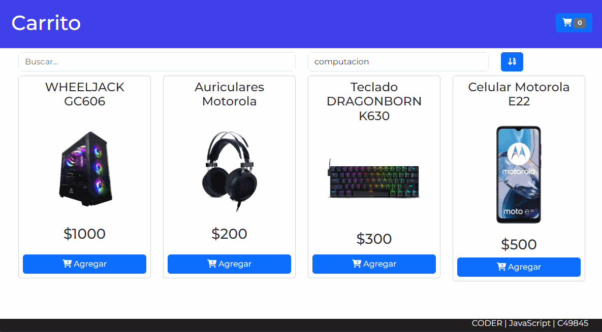

# Aster de Repaso

## 📌 Temas
- Recorridos de Arrays
- Funciones de Orden Superior: find, findIdex, filter, reduce
- Clases
- Selecciones de elementos del DOM
- Eventos
- Renderizados


### 📌 Class Cart

``` js
class Cart {
    constructor( list=[] ){
        
    }

    addToCart( product){
    }

    getProducts() { }

    getCount(){ }

    getSum(){ }
}
```

---



